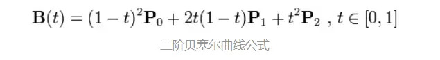
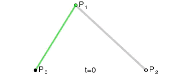
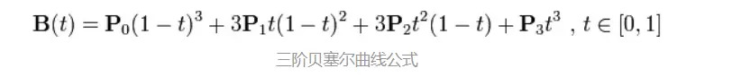
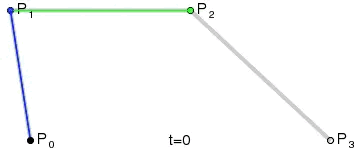
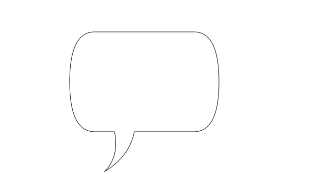
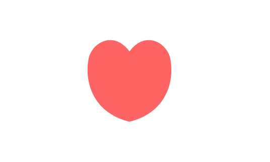

canvas 挺多方法都挺好理解的，这里学习记录一下如何用贝塞尔曲线来绘制路径。

首先我们先来看看什么是贝塞尔曲线，不用去深究函数的推导过程以及如何使用，我们只需要知道在绘制的时候大概的走向就可以。

贝塞尔二阶曲线：

 

 

贝塞尔三阶曲线：

 

 

[https://aaaaaaaty.github.io/bezierMaker.js/playground/playground.html](https://aaaaaaaty.github.io/bezierMaker.js/playground/playground.html)该网站能让我们直观了解绘制的过程，除了二阶、三阶，甚至 n 阶都可以绘制，因为其原理是类似的，都是前面推导出来的。


了解了贝塞尔曲线的大概走向，我们还需要知道 canvas 中关于贝塞尔曲线的绘制函数和参数的含义。

> quadraticCurveTo(cp1x, cp1y, x, y)
> 绘制二次贝塞尔曲线，cp1x,cp1y 为一个控制点，x,y 为结束点。
>
> bezierCurveTo(cp1x, cp1y, cp2x, cp2y, x, y)
> 绘制三次贝塞尔曲线，cp1x,cp1y为控制点一，cp2x,cp2y为控制点二，x,y为结束点。

其实就是需要控制点和结束点的坐标，一开始可能比较难找，但熟悉了之后大概找个位置，然后慢慢调就可以了。

用二阶贝塞尔曲线画一个聊天气泡：
```html
...
<body onload="draw()">
  <canvas id="canvas" width="600" height="400"></canvas>
  <script>
    function draw() {
      /** @type {HTMLCanvasElement} */
      var canvas = document.getElementById('canvas');
      if (canvas.getContext) {
        var ctx = canvas.getContext('2d');
        // 贝塞尔二次曲线
        quadraticCurveTo(cp1x, cp1y, x, y)
        ctx.beginPath()
        ctx.moveTo(200, 300)
        ctx.quadraticCurveTo(150, 300, 150, 200)
        ctx.quadraticCurveTo(150, 100, 200, 100)
        ctx.lineTo(400, 100)
        ctx.quadraticCurveTo(450, 100, 450, 200)
        ctx.quadraticCurveTo(450, 300, 400, 300)
        ctx.lineTo(280, 300)
        ctx.quadraticCurveTo(270, 350, 220, 380)
        ctx.quadraticCurveTo(250, 350, 240, 300)
        ctx.lineTo(200, 300)
        ctx.stroke()
        ctx.closePath()
      }
    }
  </script>
</body>
```
效果图：


用三阶贝塞尔曲线画一个爱心：

```html
...
<body onload="draw()">
  <canvas id="canvas" width="600" height="400"></canvas>
  <script>
    function draw() {
      /** @type {HTMLCanvasElement} */
      var canvas = document.getElementById('canvas');
      if (canvas.getContext) {
        var ctx = canvas.getContext('2d');

        // 贝塞尔三次曲线
        ctx.beginPath()
        ctx.moveTo(300, 300)
        ctx.bezierCurveTo(220, 280, 210, 210, 220, 170)
        ctx.bezierCurveTo(230, 140, 270, 120, 300, 160)
        ctx.bezierCurveTo(330, 120, 370, 140, 380, 170)
        ctx.bezierCurveTo(390, 210, 380, 280, 300, 300)
        ctx.fillStyle = 'rgb(360, 100, 100)'
        ctx.fill()
        ctx.closePath()
      }
    }
  </script>
</body>
```
效果图：



可以看到，三阶相对二阶可以画出更加饱满的曲线，灵活度和自由度也更高。在选取控制点位置的时候，我们心中要有对应的动态图，然后根据想象去调整控制点位置，说起来比较抽象，需要多实践。

在使用贝塞尔曲线的时候，总让我想起了在 PhotoShop 中使用钢笔抠图（原理应该是一致的），虽然比较麻烦，但抠出来的很精细，这里也一样，画起来麻烦，但可以达到自己预想的效果。

分享这一篇的原因是本来感觉挺难的，之前学高数看到这个贝塞尔曲线也比较抗拒（ - -），但这里学完使用方法之后发现也挺简单的（不是说公式简单），知道了怎么画贝塞尔曲线，搭配其他画路径的方法，基本想画啥就画啥，只要想象力足够丰富。