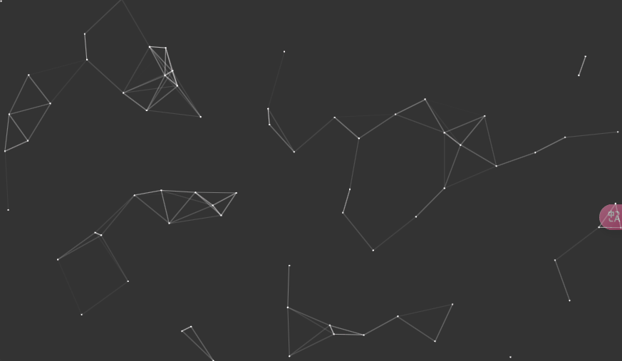
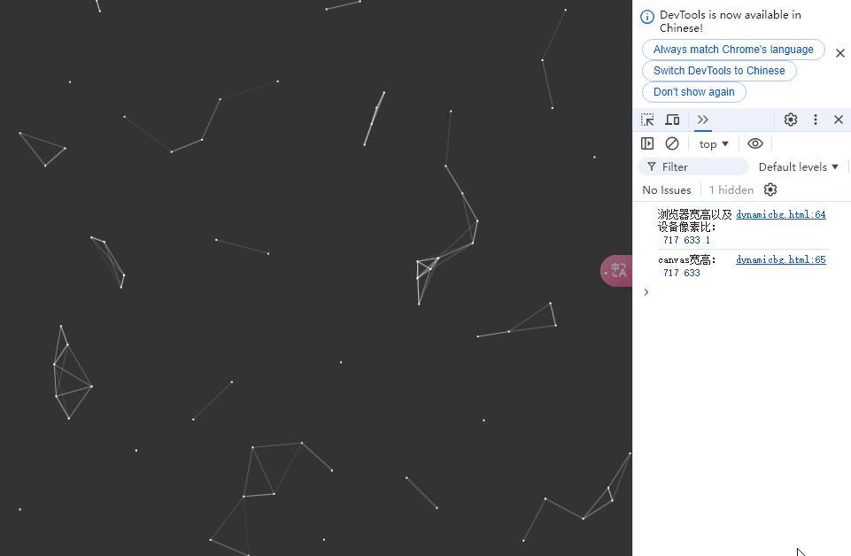

今天用canvas来实现一个比较常见的动态背景，效果如下：



## 思路
实现思路就是在这个画布上随机生成一些点，然后让这些点存在一个数组里，让每一个点和后面的所有点连线，连线的透明度随着两点之间的距离增长而减少，如果超过一个阈值距离则不连线。

然后控制一下点的运动以及碰撞到边界进行反弹即可。

## 代码
```html
<!DOCTYPE html>
<html lang="en">
<head>
    <meta charset="UTF-8">
    <meta name="viewport" content="width=device-width, initial-scale=1.0">
    <title>Document</title>
    <style>
        canvas {
            width: 100%;
            height: 100%;
            position: fixed;
            top: 0;
            left: 0;
        }
    </style>

</head>
<body>
    <canvas id="canvas"></canvas>
</body>
<script src="./PointsAndLines.js"></script>
<script>
    const canvas = document.getElementById('canvas');
    canvas.width = window.innerWidth * devicePixelRatio;
    canvas.height = window.innerHeight * devicePixelRatio;
    
    console.log(window.innerWidth, window.innerHeight, devicePixelRatio)
    console.log(canvas.width, canvas.height);

    canvas.style.background = 'rgba(0, 0, 0, 0.8)';
    const ctx = canvas.getContext('2d');

    const pal = new PointsAndLines(70, canvas.width, canvas.height, 1, 0.5, canvas.width / 10);
    pal.draw(ctx);
</script>
</html>
```
```js
// PointsAndLines.js
class Point {
    constructor(x, y, r, speed) {
      this.x = x;
      this.y = y;
      this.r = r
      this.xSpeed = (Math.random() > 0.5? speed : -speed) * Math.random();
      this.ySpeed = (Math.random() > 0.5? speed : -speed) * Math.random();
    }
    draw(ctx) {
      ctx.beginPath();
      ctx.arc(this.x, this.y, this.r, 0, 2 * Math.PI);
      ctx.fillStyle = "#fff";
      ctx.fill();
    }
}

class Line {
    constructor(p1, p2, maxDis) {
      this.p1 = p1;
      this.p2 = p2;
      this.maxDis = maxDis;
    }
    draw(ctx) {
      ctx.beginPath();
      ctx.moveTo(this.p1.x, this.p1.y);
      ctx.lineTo(this.p2.x, this.p2.y);
      // 勾股定理求两点之间的距离
      const dis = Math.sqrt(Math.pow(this.p1.x - this.p2.x, 2) + Math.pow(this.p1.y - this.p2.y, 2));
      if(dis > this.maxDis) return;
      ctx.strokeStyle = `rgba(255, 255, 255, ${1 - dis / this.maxDis})`;
      ctx.stroke();
    }
}


class PointsAndLines {
    // 生成点的数量、画布的宽、高、点的半径、移动的速度、连线距离阈值
    constructor(pointNum, width, height, r, speed, maxDis = 200) {
        this.points = new Array(pointNum).fill(0)
            .map(() => new Point(Math.random() * width, Math.random() * height, r, speed))
        this.preDrawDate = null;
        this.width = width;
        this.height = height;
        this.maxDis = maxDis;
    }
    draw(ctx) {
        ctx.clearRect(0, 0, this.width, this.height);
        // 首次打开
        if (!this.preDrawDate) {
            this.points.forEach((point, index) => {
                point.draw(ctx)
                // 连线
                for(let i = index + 1; i < this.points.length; i++) {
                    const line = new Line(point, this.points[i], this.maxDis);
                    line.draw(ctx)
                }
            })
        } else {
            this.points.forEach((point, index) => {
                point.x += point.xSpeed;
                point.y += point.ySpeed;
                // 触碰边缘修改方向
                if(point.x <= point.r || point.x >= this.width - point.r) point.xSpeed = -point.xSpeed;
                if(point.y <= point.r || point.y >= this.height - point.r) point.ySpeed = -point.ySpeed;
                point.draw(ctx)
                // 连线
                for(let i = index + 1; i < this.points.length; i++) {
                    const line = new Line(point, this.points[i], this.maxDis);
                    line.draw(ctx)
                }
            })
        }
        this.preDrawDate = new Date()
        requestAnimationFrame(() => this.draw(ctx))
    }
}
```
大概的实现方式就是这样，里面还有许多可以优化的地方，例如限制创建点的时候位置不能在边缘，更加自然的运动速度、方向以及连线算法等等，但作为一个demo练习目前已经可以了。

## 缩放问题
可能你会注意到我在设置canvas的宽高时乘上了一个`devicePixelRatio`：
```js
canvas.width = window.innerWidth * devicePixelRatio;
canvas.height = window.innerHeight * devicePixelRatio;
```
这个`devicePixelRatio`是设备像素比，等于`物理像素 / 逻辑像素`，这里面的逻辑像素其实就是一般css样式或者js中拿到的像素，而物理则是设备本身的实际像素。

那么为什么要乘上这么一个值呢？我们不妨先把这个乘值去掉，看看会出现什么情况：


基于上面的公式，当你放大视口的时候，相当于拿着放大镜去看，`devicePixelRatio`会变大，`window.innerWidth`和`window.innerHeight`会变小，缩小视口则相反，而物理像素是始终不变的。

这样会导致逻辑像素与物理像素不统一，造成的后果就是显示的图片失真，那么我们要做的就是保持逻辑像素与物理像素的统一，这样无论你如何缩放视口，看到的内容都是一致的。

现在思路就比较清晰了，要让物理像素和逻辑像素保持一致，由于`物理像素 = 逻辑像素 * 设备像素比`，那么我把canvas的宽高也这么设置不就行了？所以就有了代码那一段，效果如下：


虽然gif比较模糊，但可以看到无论如何缩放，canvas都保持原样不会失真，并且宽高基本不变或者由于精度问题在很小的范围内变动。