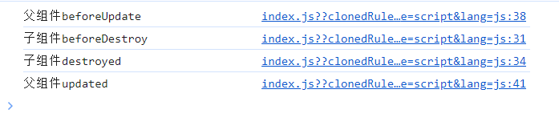

## 前言
今天来探讨一下嵌套组件生命周期钩子的调用顺序，这也是很常见的面试题之一，而了解嵌套的生命周期钩子调用顺序也有助于我们开发。这些钩子看起来很简单，但在嵌套组件的情况下，可能没有你想象中那么简单。

由于vue3的生命周期钩子中少了beforeCreate和create钩子，先用vue2来测试一下。

## 代码
首先把简单的代码写好，只有父子组件：
```vue
// 父组件
<template>
  <div v-if="isShow" id="app">
    父组件input：<input v-model="input"/>
    <button @click="isShowChild = !isShowChild">{{isShowChild ? '隐藏' : '显示'}}子组件</button>
    <button @click="selfDestory">boom!</button>
    <HelloWorld v-if="isShowChild" :msg="input" @childCount="handleChildCount"/>
    <h3>{{childCount}}</h3>
  </div>
</template>

<script>
import HelloWorld from './components/HelloWorld.vue'

export default {
  name: 'App',
  components: {
    HelloWorld
  },
  data() {
    return {
      input: '',
      isShowChild: true,
      isShow: true,
      childCount: null
    }
  },
  methods: {
    selfDestory() {
      this.isShow = false
      // 确保在调用 this.$destroy 之前，所有的 DOM 更新操作都已经完成
      this.$nextTick(() => {
        this.$destroy()
      })
    },
    handleChildCount(value) {
      this.childCount = value
    }
  },
  beforeCreate() {
    console.log("父组件beforeCreate")
  },
  created() {
    console.log("父组件created")
  },
  beforeMount() {
    console.log("父组件beforeMount")
  },
  mounted() {
    console.log("父组件mounted")
  },
  beforeUpdate() {
    console.log("父组件beforeUpdate")
  },
  updated() {
    console.log("父组件updated")
  },
  beforeDestroy() {
    console.log("父组件beforeDestroy")
  },
  destroyed() {
    console.log("父组件destroyed")
  }
}
</script>

// 子组件
<template>
  <div class="hello">
    <h1>{{ msg }}</h1>
    子组件input：<input v-model="input"/>

    <button @click="handleCount">{{count}}</button>
  </div>
</template>

<script>
export default {
  name: 'HelloWorld',
  props: {
    msg: String
  },
  data() {
    return {
      input: '',
      count: 0
    }
  },
  methods: {
    handleCount() {
      this.count++
      this.$nextTick(() => {
        this.$emit('childCount', this.count)
      })
    }
  },
  beforeCreate() {
    console.log("子组件beforeCreate")
  },
  created() {
    console.log("子组件created")
  },
  beforeMount() {
    console.log("子组件beforeMount")
  },
  mounted() {
    console.log("子组件mounted")
  },
  beforeUpdate() {
    console.log("子组件beforeUpdate")
  },
  updated() {
    console.log("子组件updated")
  },
  beforeDestroy() {
    console.log("子组件beforeDestroy")
  },
  destroyed() {
    console.log("子组件destroyed")
  }
}
</script>
```

## 测试
然后把服务跑起来，一进页面就能看到控制台输出如下：


可以看到这个顺序也是比较符合我们的直觉的，父组件创建之后在挂载之前，需要等待子组件都创建挂载完，父组件才算挂载完。

然后注意看我在父子组件中都写了一个input，并且都进行了v-model绑定，同时父组件输入的内容还会传递到子组件中进行展示。那么当父组件输入内容时，生命周期钩子的调用顺序是如何呢？请看下图：


类似一个递归结构，从外到里再从里到外。

那么当子组件中的input内容发生改变时，是否也是同样的结果呢？答案是不一样的，结果只输出了子组件的beforeUpdate和updated，父组件并没有参与。同样的，父组件没有把input的值传递给子组件展示的话，结果也会只展示父组件的更新钩子。

那么如果反过来，父组件中展示子组件传过来的值，如代码中的子组件中的计数器，每次增加之后都会通过emit把值传递给父组件进行展示，那么执行顺序是什么样的呢？请看下图：


答案是子组件完全更新之后才会触发父组件的更新。

从这些例子就能看出，需要父子组件之间有进行通信（注：本文中说的通信指的是会**引起页面更新**的通信，也就是页面要有渲染更新的值，如果值更新但是没有渲染时不会触发更新钩子的），并且通信的依赖发生改变，才会同时触发父组件和子组件的生命周期钩子，并且还会因为情况不同而导致执行顺序不同。

然后是点击隐藏子组件按钮，结果输出如下：



可以看到，销毁子组件也会触发父组件的更新。

点击显示子组件，结果大家也能猜出来，但是别忘了有个创建和挂载的过程哦：


最后点击boom！按钮，也就是销毁父组件，结果如下：


这里也可以看到组件销毁的过程，是子组件先销毁，最后才销毁父组件，并且在销毁子组件之前还会触发父组件的更新钩子，这点可能容易遗漏。

vue3的生命周期钩子和vue2大同小异，只不过setup中就包含了beforeCreate和created这两个钩子，经过测试和vue2的执行顺序是一致的。

## 总结
通过测试，可以总结一下vue2中嵌套组件生命周期的执行顺序：
1. 父组件beforeCreate
2. 父组件created
3. 父组件beforeMount
4. 子组件beforeCreate
5. 子组件created
6. 子组件beforeMount
7. 子组件mounted
8. 父组件mounted
9. 父组件beforeUpdate（这里仅代表由父组件引起的更新并且与子组件有通信时的情况）
10. 子组件beforeUpdate
11. 子组件updated
12. 父组件updated
13. 父组件beforeUpdate（子组件销毁会触发父组件的更新钩子）
14. 子组件beforeDestroy
15. 子组件destroyed
16. 父组件updated
17. 父组件beforeDestroy（子组件完全卸载才开始销毁父组件）
18. 父组件destroyed

大部分顺序都比较符合我们的直观感受，从里到外再从外到里，但是有些情况也容易记错，如：
1. 在组件创建挂载时的顺序，应该注意是**父组件完全创建完**，在挂载之前才去创建子组件。
2. 组件更新时会因为引起更新的组件的不同产生不同的顺序。若父子组件没有进行通信，那么只会触发各自的更新钩子。如果父子组件之间有通信，那么还有两种情况：①是由父组件引起的更新，这时会触发**父子子父**的顺序；②是由子组件引起的更新，这时会触发**子子父父**的顺序。
3. 子组件销毁时会触发父组件的更新钩子，并且是**子组件完全销毁后**才触发父组件的beforeDestory。