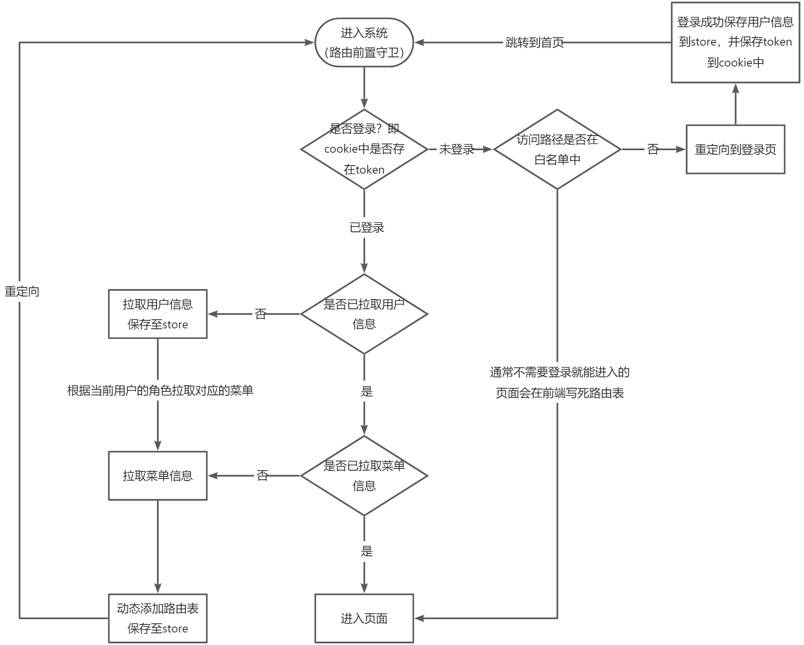

趁着有空研究了下一个后台管理项目的动态路由，先贴一下大致的代码：
```js
const whiteList = ['/login']// no redirect whitelist

router.beforeEach((to, from, next) => {
  // 设置title
  if (to.meta.title) {
    document.title = to.meta.title + ' - ' + Config.title
  }
  NProgress.start() // 开启进度条
  if (getToken()) {
    // 已登录且要跳转的页面是登录页
    if (to.path === '/login') {
      next({ path: '/' }) // 重定向到首页
      NProgress.done()
    } else {
      if (store.getters.roles.length === 0) { // 判断当前用户是否已拉取完user_info信息
        store.dispatch('GetInfo').then(() => { // 拉取user_info
          // 动态路由，拉取菜单
          loadMenus(next, to)
        }).catch(() => {
          store.dispatch('LogOut').then(() => {
            location.reload() // 为了重新实例化vue-router对象 避免bug
          })
        })
      // 登录时未拉取 菜单，在此处拉取
      } else if (store.getters.loadMenus) {
        // 修改成false，防止死循环
        store.dispatch('updateLoadMenus')
        loadMenus(next, to)
      } else {
        next()
      }
    }
  } else {
    /* has no token*/
    if (whiteList.indexOf(to.path) !== -1) { // 在免登录白名单，直接进入
      next()
    } else {
      next(`/login?redirect=${to.fullPath}`) // 否则全部重定向到登录页
      NProgress.done()
    }
  }
})

const loadMenus = (next, to) => {
  buildMenus().then(res => {
    const rdata = JSON.parse(JSON.stringify(res))
    const rewriteRoutes = filterAsyncRouter(rdata, false, true) // 将请求到的结果构建成路由表
    rewriteRoutes.push({ path: '*', redirect: '/404', hidden: true })

    store.dispatch('GenerateRoutes', rewriteRoutes).then(() => { // 存储路由
      router.addRoutes(rewriteRoutes) // 动态添加可访问路由表
      next({ ...to, replace: true })
    })
  })
}
```

单看着有点绕，我把他梳理成如下的流程图：


经过梳理之后思路还是比较清晰的，权限是根据用户的角色来决定的，如管理员、业务、运维，他们的权限不同，能看到的菜单也不同。

在这个流程中，如果只是想展示添加动态路由的过程，那么拉取用户的信息其实是没必要的，但用户信息对于整个项目来说是必要的，所以也一同加进去了，也会让整个流程更加的完整。

一开始我以为是为了获取用户的角色才有必要拿到用户的信息，然后根据角色去获取菜单的。但实际上拉取菜单的接口是不带任何参数的，后端是根据每次请求中的cookie去确认用户的身份，也就能确定用户的角色了，这种做法也更加的安全。

这里补充一些细节，在添加动态路由之后，为什么要使用```next({ ...to, replace: true })```，而不使用```next()```直接放行?

原因是直接使用```next()```放行会导致白屏。因为 addRoutes 并不像看上去那么简单，内部还需要处理很多的逻辑，所以当放行的时候可能还没执行完毕才导致的白屏。

而```next({...to, replace: true})```会拦截当前的路由，重定向到 to 的路径去，如果在路由表找不到，会一直尝试直到找到为止。当找到之后重新进入路由前置守卫时，就能走到```next()```的分支去，渲染对应的组件啦。

此外，```filterAsyncRouter```这个函数的作用就是遍历后台传来的路由字符串，转换为组件对象，例如后台传过来的对象长这样：
```js
{
  "children": [
    {
      "children": [
        // ...
      ],
      "component": "ParentView",
      "hidden": false, // 是否渲染菜单
      "meta": {
        "icon": "app",
        "noCache": true, // 路由缓存
        "title": "关于"
      },
      "name": "关于",
      "path": "about",
      "redirect": "noredirect"
    }
  ],
  "component": "Layout",
  "hidden": false,
  "meta": {
    "icon": "app",
    "noCache": true,
    "title": "首页"
  },
  "name": "首页",
  "path": "/home",
  "redirect": "noredirect"
}
```
可以看到，后端已经将路由表基本结构化好了，前端只需要把其中的```component```字段上的字符串替换成实际的组件即可，参考写法如下：
```js
const loadView = (view) => {
  return (resolve) => require([`@/views/${view}`], resolve)
}
```

还有一点，把登录页添加到白名单中是有必要的，因为登录页不需要进行身份认证。但是流程图中为了体现登陆成功把信息保存这一点，加上了重定向到登录页这一个节点，绕过了一点中间的流程。

还有什么问题欢迎提出一起讨论~