## 开通百度统计
我是使用[百度统计](https://tongji.baidu.com/web/welcome/login)来统计浏览量的，首先要注册账号，如果有了也可以直接登陆。我用的账号的普通的百度账号，而不是营销账号。

登陆之后就能看到如下界面，并且点击使用设置：
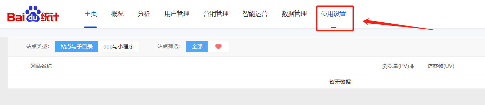

点击之后进入设置页面，可以新建网站：
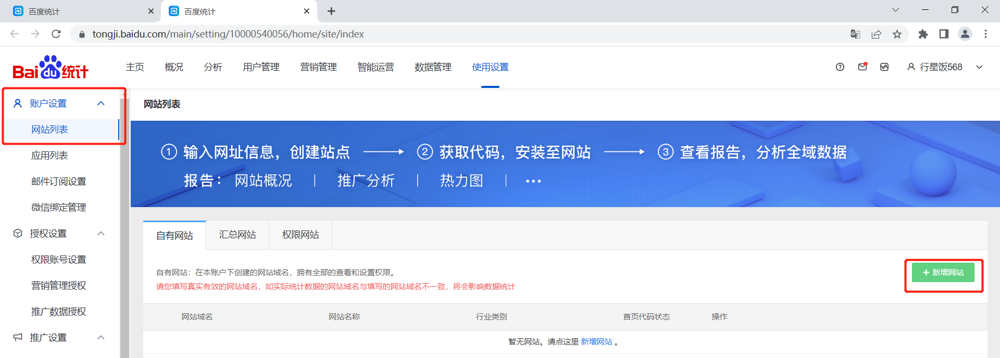

然后填入信息：
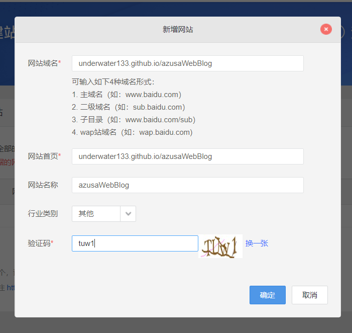

确定之后就能看到百度给的脚本了：
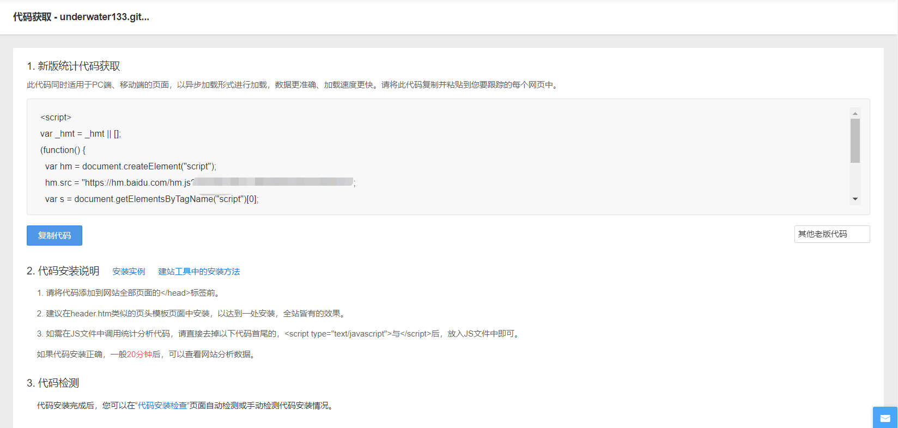

## 配置代码

按照他的教程，把脚本添加到我们的所有页面里面。由于使用vuepress构建后的是静态页面，切换页面也不会触发请求，所以我们需要在进去网站的时候就把这段脚本加上，而且在切换页面的时候也需要触发统计。

现在先把代码加到我们的页面中：
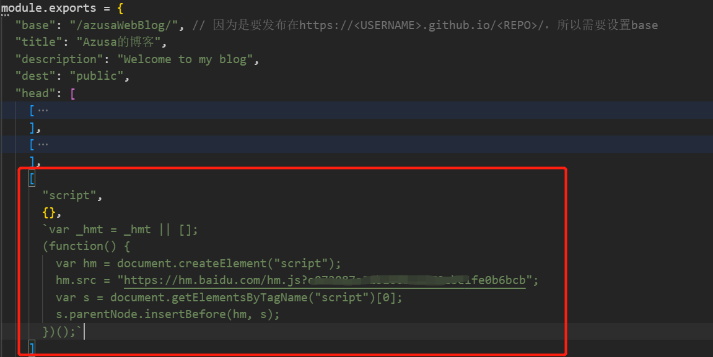

接下来添加 config 同级文件 enhanceApp.js，添加如下代码：
```js
export default ({ router }) => {
  // 路由切换事件处理
  router.beforeEach((to, from, next) => {
    //触发百度的pv统计
    if (typeof _hmt != "undefined") {
      if (to.path) {
        _hmt.push(["_trackPageview", to.fullPath]);
      }
    }
    next();
  });
};
```
然后等一段时间，大概20分钟，如果配置正确的话就能看到数据了！
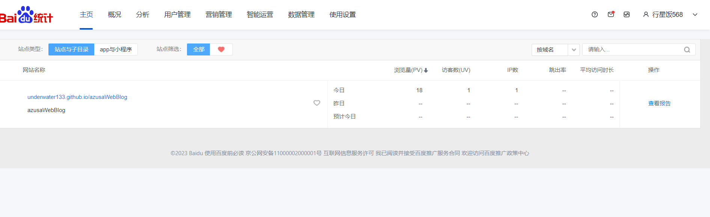

那么接下来就是把数据引入到我们的网站里面了。我们可以阅读[百度统计的文档](https://tongji.baidu.com/api/manual/Chapter2/openapi.html)来开通数据api，但是开通需要前一天网站的阅读量超过100才可以，所以目前我还开通不了，自己随便点点几下就好了，只能明天再继续了。

## 数据导出

-- one day later --
今天可以开通数据导出服务了，开通后我们会获取到API Key与Secret Key，如下图：
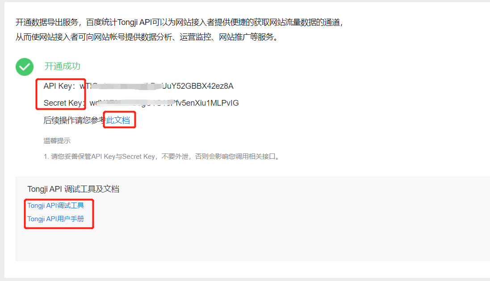
注意图中的统计工具和文档，后面调试的时候需要用到。

然后我们点击 此文档 继续后面的操作。

首先利用 api key 去获取 code：
```
 http://openapi.baidu.com/oauth/2.0/authorize?response_type=code&client_id={CLIENT_ID}&redirect_uri=oob&scope=basic&display=popup
```
其中的CLIENT_ID就是api key。

获取到code之后，通过code、CLIENT_ID和Secret Key去获取 ACCESS_TOKEN，这个就是我们要调用接口的凭证了：
```
http://openapi.baidu.com/oauth/2.0/token?grant_type=authorization_code&code={CODE}&client_id={CLIENT_ID}&client_secret={CLIENT_SECRET}&redirect_uri=oob
```
返回结果如下：
```js
{
    "expires_in": 2592000,
    "refresh_token":"2.385d55f8615fdfd9edb7c4b5ebdc3e39.604800.1293440400-2346678-124328",
    "access_token":"1.a6b7dbd428f731035f771b8d15063f61.86400.1292922000-2346678-124328",
    "session_secret":"ANXxSNjwQDugf8615OnqeikRMu2bKaXCdlLxn",
    "session_key":" 248APxvxjCZ0VEC43EYrvxqaK4oZExMB",
    "scope":"basic"
}
```
此外还有一个参数需要获取，那就是site_id，也就是我们网站的id，需要调用查询自己的网站列表api去获取：
```
https://openapi.baidu.com/rest/2.0/tongji/config/getSiteList?access_token=1.a6b7dbd428f731035f771b8d15063f61.86400.1292922000-2346678-124328
```
把其中的 access_token 换成你自己的。

返回的结果如下：
```js
{
    "list": [
        {
            "site_id": 18957957,
            "domain": "xxx",
            "status": 0,
            "create_time": "2023-04-04 17:58:49",
            "sub_dir_list": []
        }
    ]
}
```
记住这个site_id。

然后我们回到刚开通数据导出服务的那个页面，点击api调试工具，来到调试界面，选择百度账号之后，填入自己的 access_token，选择获取报告数据，网站概况(趋势数据)，最后再填入参数就OK啦。

这里我们简单试一下，查询一下浏览量：
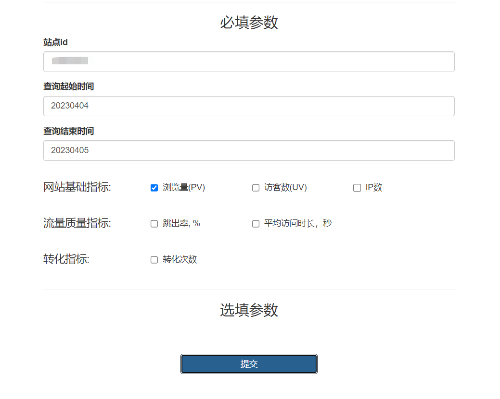
点击提交之后，就会自动帮我们生成请求链接和响应结果：
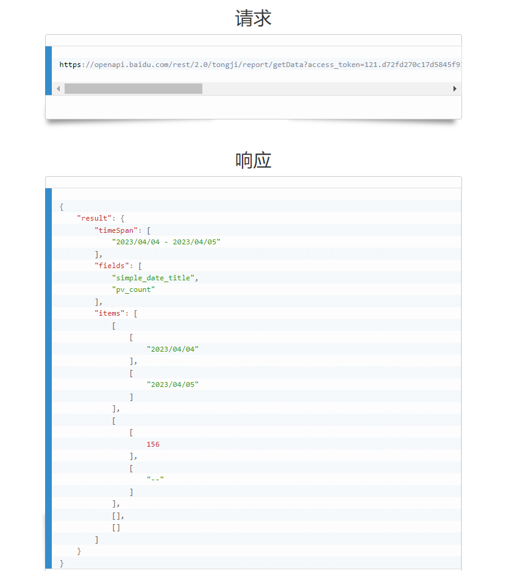
我们就可以拿着这个链接放到我们的博客里啦。

然后我只能查出总的访问量，不能看到每个子页面的访问量，可能是我设置站点的时候有些地方出错了。但经过查阅用户手册，发现可以通过调用 受访页面 的接口来获取每个页面的访问量。
```
https://openapi.baidu.com/rest/2.0/tongji/report/getData?access_token=xxxxxxxx&site_id=xxxx&method=visit/toppage/a&start_date=20190101&end_date=20190105&metrics=pv_count,visitor_count
```
其实就是 method 不一样。

那么我们可以在之前的 enhanceApp.js 中请求访问量，代码如下：
```js
import { getPV } from "../util/api";
export default ({ router }) => {
  // 路由切换事件处理
  router.beforeEach((to, from, next) => {
    //触发百度的pv统计
    if (typeof _hmt != "undefined") {
      if (to.path) {
        _hmt.push(["_trackPageview", to.fullPath]);
        getPV().then(res => {
          if (res.error_code) {
            // Access token 过期了
          } else {
            const items = res.data.result.items || []
            const page = items[0] || [], vis = items[1] || []
            let pv = 0
            // 主页统计全部
            if(to.path == '/') {
              page.forEach((value, index) => {
                // 只统计该域名下的，因为开发的时候访问也会被计算这里分开统计
                if(value[0].name.indexOf(window.location.origin) > -1) {
                  pv += vis[index][0]
                }
              })
            } else {
              const pathUrl = window.location.origin + to.path
              for(let i = 0, n = page.length; i < n; i++) {
                if(page[i][0].name == pathUrl) {
                  pv = vis[i][0]
                  break
                }
              }
            }
            console.log(pv)
          }
        })
      }
    }
    next();
  });
};
```

## 展示浏览量

到这里已经只差最后一步了，那就是把浏览量展示到我们的主页还有每篇博客上面。因为我使用的主题是vuepress-theme-reco，所以需要在node_modules中找到主题的源代码，自己修改想要显示浏览量的位置。

例如在首页中，我希望把浏览量设置在底部备案的位置：
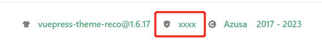

所以我们需要找到Footer组件，经过我的一番寻找，发现他在node_modules/vuepress-theme-reco/components下，我们直接把备案的那串代码注释掉，添加如下代码：
```
<!-- template -->
<span>
  <reco-icon icon="reco-eye" />
  <a>
    <span>{{ pv }}</span>
  </a>
</span>

<!-- js -->
setup() {
  ...
  const pv = window.pv
  return { ..., pv}
}
```
然后重新启动项目，就能看到效果了：


接下来就是在博客文章的页面加上了，继续翻源码，还是在刚刚的component目录下，找到PageInfo，进去刚刚相同的操作就好了。但是发现他原本就有这一段代码：
```html
<reco-icon
  v-if="showAccessNumber === true"
  icon="reco-eye"
>
  <AccessNumber :idVal="pageInfo.path" :numStyle="numStyle" />
</reco-icon>
```
也就是说官方是支持阅读量的，但通过查阅官方文档后，他们的这么解释的：

>浏览量 仅在使用 Valine 时显示；
>
>因为 浏览量 需要在页面加载时去调用相关接口，所以列表页的所有数据会一起加载下来，如果文章数量很多会影响加载速度，所以在 1.2.0 之后去掉文章列表的浏览量。

那我们也不用管了，直接使用百度的统计API就行。

修改之后可以看到如下效果：
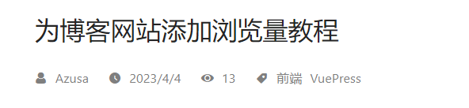

## 调试

本以为大功告成了，没想到回到首页一看，寄，首页中文章列表也是用的这个组件，所以浏览量变成了首页的：
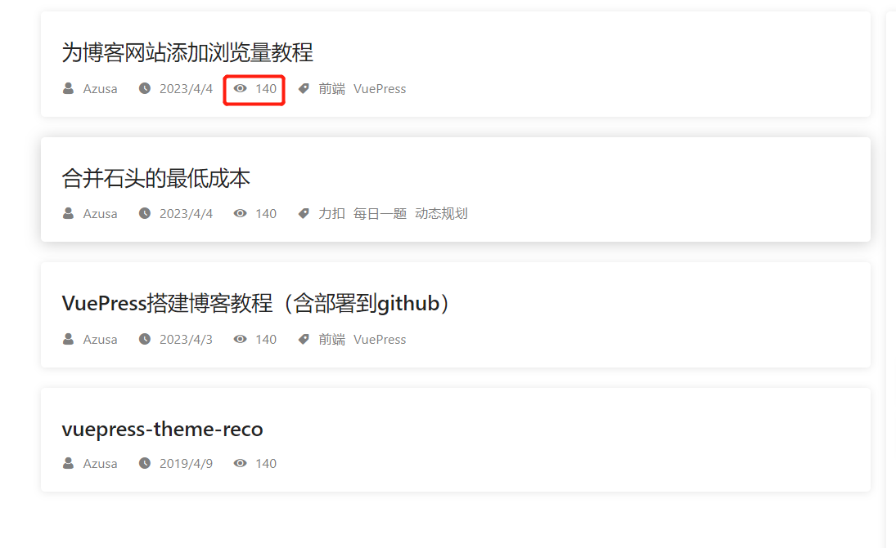

那么现在的问题是在首页的时候需要获取到各个页面的浏览量，这个好办，我们把之前pv变量设置成一个对象，把页面的url作为key，然后值为浏览量。稍微修改一下 enhanceApp.js 中相关的部分：
```js
import { getPV } from "../util/api";
export default ({ router }) => {
  // 路由切换事件处理
  router.beforeEach(async (to, from, next) => {
    //触发百度的pv统计
    if (typeof _hmt != "undefined") {
      if (to.path) {
        _hmt.push(["_trackPageview", to.fullPath]);
        await getPV().then(res => {
          let pv = {} // 修改为一个对象
          if (res.error_code) {
            // Access token 过期了
          } else {
            const items = res.data.result.items || []
            const page = items[0] || [], vis = items[1] || []
            const n = page.length
            // 首页把全部页面的浏览量添加进去
            if(to.path == '/') {
              let total = 0
              page.forEach((value, index) => {
                if(value[0].name.indexOf(window.location.origin) > -1) {
                  total += vis[index][0]
                }
              })
              pv['home'] = total
              for(let i = 0; i < n; i++) {
                pv[page[i][0].name] = vis[i][0]
              }
            } else {
              const pathUrl = window.location.origin + to.path
              for(let i = 0; i < n; i++) {
                if(page[i][0].name == pathUrl) {
                  pv[pathUrl] = vis[i][0] // 不是首页只添加自己的页面
                  break
                }
              }
            }
          }
          window.pv = pv
        })
      }
    }
    next();
  });
};
```

然后对应修改 Footer 组件和 PageInfo 组件的 pv 取值：
```js
// Footer.vue
const pv = window.pv['home'] || 0

// PageInfo.vue
const pv = window.pv[window.location.origin + props.pageInfo.path] || 0

// 原本我还在想，首页中是如何知道每个PageInfo组件是属于哪一篇文章的呢，因为官方原本也有实现这个功能。结果打印props一看，好家伙，信息都在里面。
// 所以可以拿到这个 props.pageInfo.path，匹配到对应的页面就可以拿到浏览量了。
```

本以为真的没问题了，没想到一打包，报了一堆错误QAQ，发现是window is not defined。又是经过了一阵查找，发现没什么特别好的解决方法。只能综合网上的方法自己想一个了。

我们就是要个全局变量可以存储 pv 这个对象，那么可以把他挂在 Vue 实例上。但又有一个问题，我们在服务端获取不了当前的页面路径，使用 window.location.domain 也会报错。最后发现 enhanceApp.js 中可以接收一个变量 isServer，判断当前是否是服务端。那么只要不是在服务端，我们就能使用 window 了。

最终修改代码如下：
```
// enhanceApp.js
import { getPV } from "../util/api";
import Vue from 'vue'
export default ({ router, isServer }) => {
  // 路由切换事件处理
  router.beforeEach(async (to, from, next) => {
    Vue.prototype.isServer = isServer
    //触发百度的pv统计
    if (typeof _hmt != "undefined") {
      // 这里稍微修改了一下，因为被编译成html了，hash值改变就不再重复添加了
      if (to.path && (to.path == '/' || to.path != from.path)) {
        _hmt.push(["_trackPageview", to.path]);
        await getPV().then(res => {
          let pv = {}
          if (res.error_code) {
            // Access token 过期了
          } else {
            const items = res.data.result.items || []
            const page = items[0] || [], vis = items[1] || []
            const n = page.length
            if(to.path == '/') {
              let total = 0
              page.forEach((value, index) => {
                if(value[0].name.indexOf(window.location.origin) > -1) {
                  total += vis[index][0]
                }
              })
              pv['home'] = total
              for(let i = 0; i < n; i++) {
                pv[page[i][0].name] = vis[i][0]
              }
            } else {
              const pathUrl = window.location.origin + to.path
              for(let i = 0; i < n; i++) {
                if(page[i][0].name == pathUrl) {
                  pv[pathUrl] = vis[i][0]
                  break
                }
              }
            }
          }
          Vue.prototype.pv = pv
        })
      }
    }
    next();
  });
};

// PageInfo.vue
let pv = 0
if(!Vue.prototype.isServer && Vue.prototype.pv) {
  pv = Vue.prototype.pv[window.location.origin + props.pageInfo.path]
}

// Footer.vue
let pv = 0
if(!Vue.prototype.isServer && Vue.prototype.pv) {
  pv = Vue.prototype.pv['home']
}
```
期间还有一个小插曲，就是本地没问题，到服务端却报错了，Uncaught DOMException: Failed to execute 'appendChild' on 'Node': This node type does not support this method. at Object.appendChild 。经过查阅和调试之后，发现是 v-if 的问题，也就是在 PageInfo 和 Footer 组件中，如果你用了 v-if 去控制浏览量的显隐，因为在服务端是不会渲染的，而到了浏览器就报错了。所以把 v-if 修改成 v-show 就可以了。

这么修改之后就基本就没问题了，看看最后的效果：
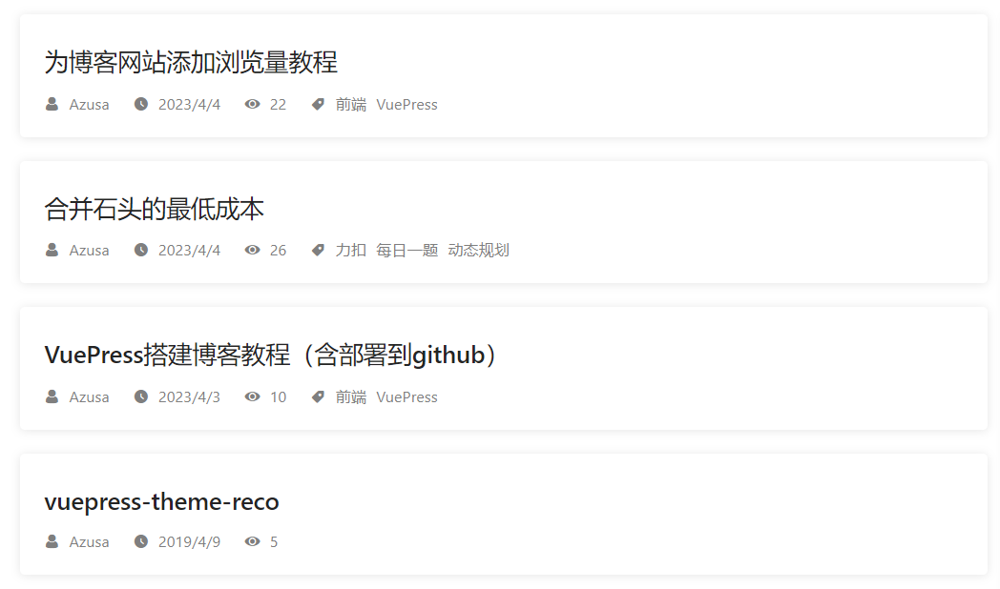
这下终于大功告成了！虽然走了不少弯路，还修改了主题的源码，但最终的效果也实现了，还是很欣慰的。

## 其他
还有一点就是百度统计的 access_token 有效期只有一个月，过期了需要用 refresh_token 去获取新的，在使用手册里面也有介绍方法。等过期了我看看啥情况再做一下自动更新吧。

现在还没有开通评论，过俩天我再研究研究，等开通之后有什么问题就可以一起讨论了。