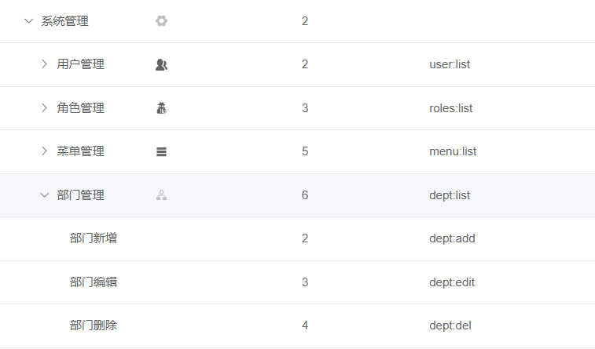

## 前言
光阴似箭，过了个年一晃就四月份了，工作之后时间真的过的飞快。从去年年底到现在都挺忙的，没什么时间更新（绝对不是因为我懒），最近趁着空闲时间，记录下一些比较常见和重要的问题，例如本次的按钮级权限控制，这里面涉及到挺多的，也让我受益匪浅。

## 角色
既然谈到了权限控制，那么肯定离不开角色，因为不同的角色拥有不同的权限，抛离了角色这个概念，那么权限控制也没有多大意义了。

所以我们这里假定是系统有了这个为用户配置角色的功能，例如管理员、测试、前端开发等等。

## 菜单
在按钮级的权限控制实现之前，也需要先实现菜单权限的分配。这个功能一般和角色分配是绑定在一起的，情景是管理员可以为不同的角色分配不同的菜单，当用户登录后，请求的菜单列表就是用户的角色所被分配的菜单。

当然，菜单权限配置的功能是可以细化到按钮级别的，在给角色分配某个菜单时，可以针对这个菜单分配一些功能权限，例如新增、修改、删除、导入导出等权限，那么页面上的按钮就会受到这些权限的限制，若没有权限则不能点击或者干脆隐藏起来了。

那么这里要讲的就是在前端如何通过结合自定义指令、vuex来控制按钮权限。

## 按钮级权限控制
整体的思路就是在登录后，将用户信息保存到vuex中，里面就包含了用户的角色。当我们进入到页面组件时，里面的按钮就可以通过自定义指令来检查当前用户是否拥有权限，例如：
```vue
<el-button
  v-permission="permission.add"
  size="mini"
  type="primary"
  icon="el-icon-plus"
  @click="xxx"
>
  新增
</el-button>

permission: {
  add: ['admin', 'roles:add'],
  edit: ['admin', 'roles:edit'],
  del: ['admin', 'roles:del']
},
```

其中，v-permission就是用来鉴权的自定义指令，具体如何实现的稍后再说，先解释一下permission这个对象的含义。

key值应该很明显，就是指具体哪一个功能，如新增、编辑、修改。而value这个数组指的是，这个操作所需要的权限标识，其中admin作为超级管理员，可以无视权限标识，而后面的roles:add则代表新增操作需要用户持有此权限标识。

那么这个权限标识是哪里来的呢，其实是在配置菜单权限时配置的，上图：

如图，我们为部门管理这个页面配置了3个按钮权限，那么用户就需要持有这些权限才可执行对应操作。在为角色配置菜单时，也就相当于将授权给角色，后端需要把这些标识信息与角色绑定。

接下来就是自定义指令了，在渲染按钮时就需要鉴权，如果权限不足则不渲染。
```vue
inserted(el, binding) {
  // value就是通过指令传来的值，例如['admin', 'roles:add']
  const { value } = binding
  // 通过store拿到用户角色拥有的权限
  const roles = store.getters && store.getters.roles
  if (value && value instanceof Array) {
    if (value.length > 0) {
      const permissionRoles = value
      // 只要角色拥有所需权限中的其中一个，则可以通过认证
      const hasPermission = roles.some(role => {
        return permissionRoles.includes(role)
      })
      // 若没有权限则将对应的按钮删除
      if (!hasPermission) {
        el.parentNode && el.parentNode.removeChild(el)
      }
    }
  } else {
    throw new Error(`使用方式： v-permission="['admin','editor']"`)
  }
}
```
这里用的是自定义指令生命周期中的inserted，也就是被绑定元素插入父节点时调用，有了该指令，就能够愉快地对各个按钮进行鉴权了。

但是这里其实有一个坑，当你使用第三方ui库的时候，给某些组件配置属性时，组件内部的实现可能没有那么直接，你配置的属性也不一定在你想要的地方生效，说起来可能有点抽象，举个例子：
```vue
<el-table xxx>
  <el-table-column prop="xxx1" label="xxx1" />
  <el-table-column prop="xxx2" label="xxx2" />
  <el-table-column prop="xxx3" label="xxx3" />
  <el-table-column label="操作" width="100px">
    <template slot-scope="scope">
      <el-button
        v-permission="permission.edit"
        size="mini"
        type="primary"
        @click="xxx"
      >
        修改
      </el-button>
      <el-button
        v-permission="permission.edit"
        size="mini"
        type="danger"
        @click="xxx"
      >
        删除
      </el-button>
    </template>
  </el-table-column>
</el-table>
```
这是个很常见的表格，操作列有编辑和删除，咋一看好像没啥问题，但是实际上，如果没有权限的话，这两个按钮将会被删除。

那么在这一列上除了表头就啥也没有了，看起来空空的很怪异，那么能不能把整一列都给删掉呢？比如把v-permission加在el-table-column上？

一开始我也是这么想的，但实际操作后发现根本不管用，在页面检查元素的时候才发现，这里配置的这些列都不是实际渲染的列，而是被隐藏起来了，如果想要删掉最后一列，应该在渲染之前就把el-table-column给干掉。

这时候v-permission的确起不了作用了，即使删掉了被隐藏的那一列也无济于事，这时就只能用自带的v-if来解决了，写一个功能类似的函数，挂在Vue实例上，然后就可以全局通用了：
```vue
Vue.prototype.checkPer = (value) => {
  if (value && value instanceof Array && value.length > 0) {
    const roles = store.getters && store.getters.roles
    const permissionRoles = value
    return roles.some(role => {
      return permissionRoles.includes(role)
    })
  } else {
    console.error(`need roles! Like v-permission="['admin','editor']"`)
    return false
  }
}
```
虽然逻辑差不多，但这里返回的是true或false，就可以通过v-if来鉴权了，例如：
```vue
<el-table-column v-if="checkPer(['admin','roles:edit','roles:del'])" label="操作" width="130px">
</el-table-column>
```
如果都不具备这些权限的话，则这一整列都不会被渲染了，这个弥补了v-permission的缺陷，可以根据需要来选择使用哪种方法。

## 总结
这里的按钮级权限就是在菜单权限得基础上再做细化，连同菜单里的按钮权限一同配置了，而这些权限是针对角色的，而非用户，因为可以将用户划分为不同的角色。在配置按钮权限时需要配置权限标识，代表是哪个模块什么功能的，一般是增删改查。

后端通过框架+注解就能进行鉴权了，而在前端控制按钮权限（显隐）可以通过自定义指令来实现，对必要的权限进行检查，在自定义指令不满足业务要求的情况下，可以使用v-if和全局方法来起到类似的结果。