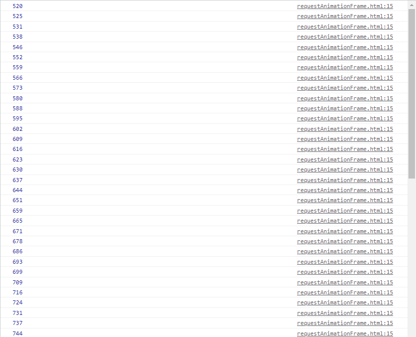
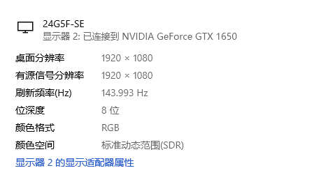
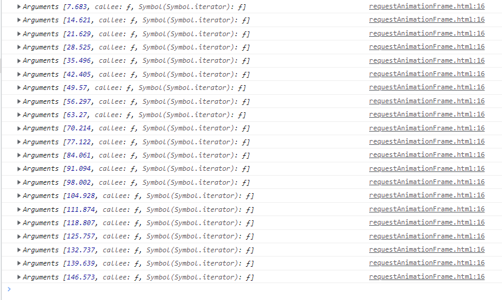

## 前言
这两天在学 canvas，刚好看到有地方使用了 requestAnimationFrame 这个方法，其实之前我也见过这个东西，与动画渲染有关，但没深入了解。既然再次碰到了，就认真学习一下用法。

## 早期定时动画
在没有这个 api 之前，js是如何制作动画的呢？答案是使用 setTimeout 和 setInterval 这两个定时器，相信大家也不陌生。但了解过事件循环的应该知道，这两个定时器并不能保证时间精度，他们只是在规定的时间后将回调函数添加到任务队列中，并不能保证回调按时执行。

并且，为了使得动画可以流畅展示，对于定时的要求也比较严格。一般 60 帧我们看起来就是比较舒服的，那么重绘的时间间隔应该是 1000毫秒/60，约为 17 毫秒。也就是在时间精度极高的情况下，重绘间隔为 17 毫秒才能让动画看起来平滑。

## requestAnimationFrame
除了重绘间隔的要求，浏览器的时间精度也是很重要的，但由于各个浏览器的时间精度不一并且精度不能满足动画平滑渲染的要求，并且浏览器还对切换到后台和不活跃的签页中定时器执行限流，所以才有了 requestAnimationFrame。

Mozilla 的 Robert O’Callahan 提出了一个方案，创造一个名为 mozrequestAnimationFrame 的新方法，用来通知浏览器某些 JavaScript 代码要执行动画了，这样浏览器就可以在运行某些代码后进行适当的优化，随着这个方案的发展，现在已经能在各个浏览器使用没有前缀的版本了，也就是 requestAnimationFrame。

requestAnimationFrame 接收一个参数，这个参数是一个要在重绘屏幕之前调用的函数。这个函数就是修改 DOM 样式以反映下一次重绘有什么变化的地方。

下面是一个展示进度条的例子：
```html
<body>
  <div id="process" style="width: 1px; height: 5px; background-color: black;"></div>
  <script>
    var a = 1
    var process = document.getElementById('process')
    function updateProcess() {
      console.log(new Date().getMilliseconds())
      if(a <= 100) {
        process.style.width = a + 'px'
        a++
        requestAnimationFrame(updateProcess)
      }
    }
    requestAnimationFrame(updateProcess)
  </script>
</body>
```

运行的动画就不看了，很平滑，我们主要来看打印的日志：


我们可以发现大约每 7 毫秒打印一次，也就是动画执行了一次。那这里为什么是 7 呢？其实和显示器的刷新频率有关，下图是我屏幕的刷新频率：



大概是 144hz，那么 1000 / 144 等于 6.94444...，约等于 7。看到这里就明白了，这个 requestAnimationFrame 还真精准，动画的平滑程度再不依赖于定时器的延时了，而是通过屏幕的刷新率决定的。

到这里，requestAnimationFrame 已经解决了浏览器不知道 js 动画什么时候开始以及最佳时间间隔是多少的问题了，但还有一个问题没解决，就是不知道自己的代码何时实际执行。其实 requestAnimationFrame 也给出了解决方案。

传递给 requestAnimationFrame 的函数实际上可以接收一个参数，此参数是一个 DOMHighResTimeStamp 的实例，表示下次重绘的时间。如果给出了精确的时间值，那么开发者也可以更好决定如何调优了。

```js
function updateProcess() {
  // console.log(new Date().getMilliseconds())
  console.log(arguments) // 打印接收的参数
  if(a <= 20) {
    process.style.width = a + 'px'
    a++
    requestAnimationFrame(updateProcess)
  }
}
```
结果如下，可以看到间隔都是 7 毫秒左右：


## cancelAnimationFrame
和 setTimeout 以及 setInterval 一样，requestAnimationFrame 也会返回一个 id，我们可以基于此 id 来取消重绘任务，这里就不展示了，用法和 clearTimeout 一样。

## 通过 requestAnimationFrame 节流
之前我们知道可以通过 setTimeout 来节流，以免大量执行大量重复的代码。但如果这些代码中包含修改 dom 样式的代码，我们想把事件处理程序的调用限制在每次重绘之前，可以通过 requestAnimationFrame 设置。

例如比较常见的滚动监听，我们一般都使用 setTimeout，在此基础上我们把 requestAnimationFrame 塞进来。通过这种方法，setTimeout 可以限制回调的执行次数，而 requestAnimationFrame 可以控制在浏览器的哪个渲染周期中去执行。

```js
let enabled = true

function operation() {
  console.log(Date.now())
}

window.addEventListener('scroll', () => {
  if(enabled) {
    enabled = false
    window.requestAnimationFrame(operation)
    window.setTimeout(() => enabled = true, 50) // 限制 50 ms执行一次。
  }
})
```

现在看来，vue 中的 nextTick 这个钩子应该是用到了这个方法（待我有空去考察一下），之前面试都没扯到这里，只说到了事件循环。

本次学习 requestAnimationFrame 就到这里了，希望有帮助到你。

有任何问题欢迎评论和我交流哦~

参考：《JavaScript高级程序设计》(第4版)