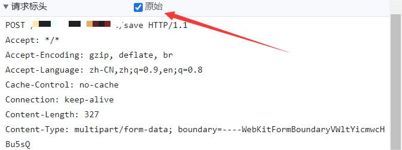
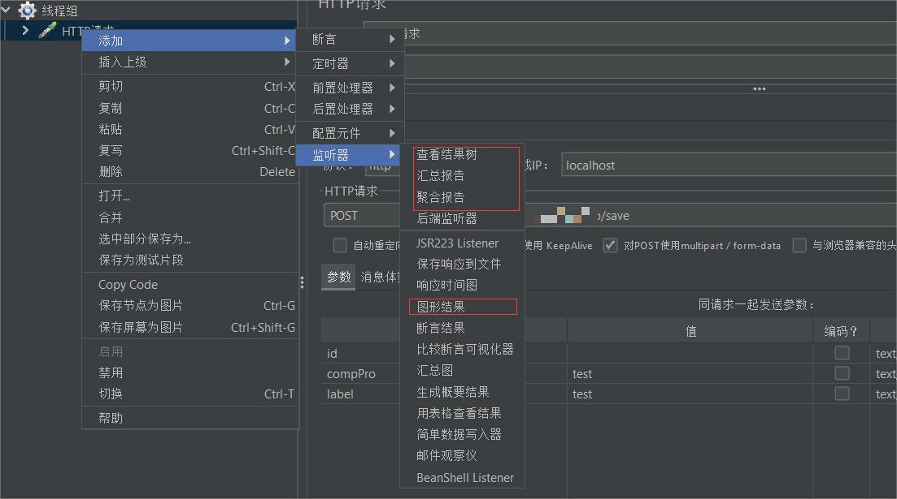

## 前言
一个小小的前端，怎么会用到这个工具呢？如果是想测试接口的话，Postman 等类似软件足矣，何必大动干戈使用 Jmeter？五星上将麦克阿瑟曾评论到，如果让外包公司中的前端工程师来，他能把前后端包括测试的工作通通完成了（其实并不能）。

开个小小的玩笑，外包公司嘛，哪里缺人就让你去哪，甚至不是同个岗位的也能补上。本次公司开发的系统出现了安全漏洞，其实就是在高并发的情况下，会往数据库插入相同的数据，尽管这在逻辑上并不是被允许的。

如何修复先不谈，至少得先复现一下问题，经过一顿查找，终于让我发现了 JMeter 这个压力测试软件，并学会简单的使用。这里补充下为何不用 Postman，Postman 虽然可以模拟并发，但也只是模拟而已，达不到令人满意的效果，他的作用还是体现在调通接口上面，而不是压力测试。
## 下载
首先来到官网的[下载页](https://jmeter.apache.org/download_jmeter.cgi)点击下载（这里只展示 Windows，注意需要 Java8 及以上的环境）：


下载之后直接解压就可以了。

## 设置
在使用之前先将语言设置成中文，在安装目录下的```bin```文件夹中找到```jmeter.properties```文件，用记事本打开，然后将```#language=en```替换成```language=zh_CN```，注意井号要去掉。

## 使用
设置成中文之后，还是在```bin```文件夹中，打开```jmeter.bat```，就会打开 Jmeter：


### 添加线程组
首先要添加一个线程组，用来配置并发的数量以及循环的次数：

设置的参数也很简单，线程数，Ramp-Up时间以及循环次数，也就是在单位时间内并发多少次请求，这个过程要循环多少遍：

这里我就简单设置成 1s 内并发 30 个请求，只循环一次。

### 添加请求
然后在线程组右键，选择添加 Http 请求：

这里我测试的是 POST 请求，而且前端传的是表单类型的数据，需要把类型勾选上。协议、IP和端口号什么的就不用多说了，记得路径需要以 / 开头，然后把参数填上。


### 添加请求头
因为我们在测试的时候可能需要一些 Cookie 啥的信息，需要设置请求头，还是右键添加：

然后就可以添加请求头了，记得不要愣头青一个一个添加，可以从剪贴板添加，也就是说你可以在网页进行一次正常的请求后，复制下请求头的信息，直接整体添加即可：

有一点需要注意的是，我们在复制请求头时，需要点击 原始 之后复制，才能正确解析放到 JMeter 中：


### 添加同步定时器
到这一步之前，其实 Postman 也同样能做到，但是这个定时器才是并发请求的关键，同样还是右键添加定时器：

添加之后注意两个参数即可：

第一个模拟数量可以理解为请求队列的容量，而第二个参数超时时间，如果设置为 0，则代表发起请求的线程数达到模拟数量之后，同时发起请求，如果达不到这个数量，则会阻塞；而如果超时时间设置大于 0，则达到这个时间后，即使请求的线程数没有达到模拟数量也会发起请求。

一般情况下，模拟数量和线程数的数量相同即可，然后把超时时间设置为 0，就能达到瞬间并发的效果。

### 添加监听器
最后一步就是添加各种监听器了，以便我们查看结果，根据需求的不同可以选择不同的监听器，这里简单添加如下几种（就是说，太高级的我也不会）：

其中对我来说最重要的一个就是**查看结果树**了，可以看到每个调用的结果，后面就只展示该监听器结果，其他的有兴趣可以自己研究研究。

### 启动！
添加完监听器之后就大功告成了，点击上面工具栏绿色的启动按钮，直接启动！

然后就可以看到右上方在等待线程数达到定时器中的模拟数量，然后再全部释放，我们就能在监听器中看到结果了：

悲！可以看到这接口确实是有点问题的，并且也确实插入了很多条相同的数据，接下来应该要学习一下加锁之类的操作了。

好了，本篇内容就到这里，记录一下学习的过程，如果对你有帮助就更好了~